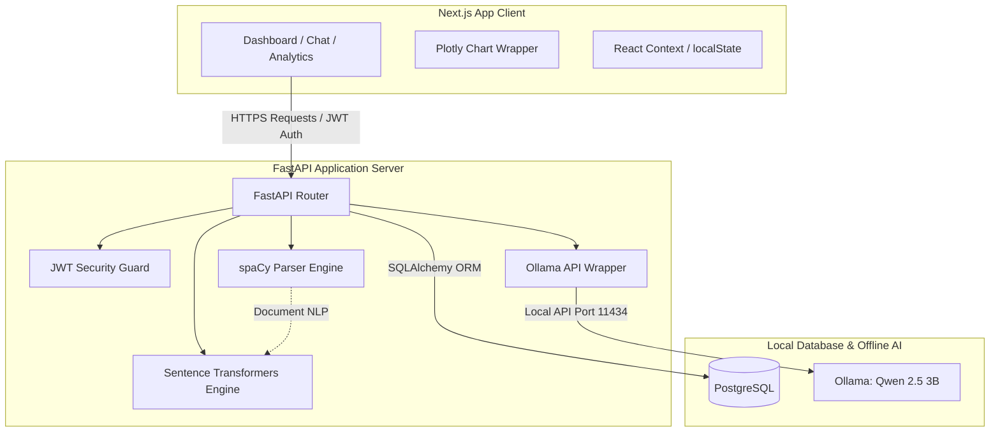

# CareerPilot AI

### *The Intelligent Career Copilot*

[](LICENSE)
[](https://nextjs.org/)
[](https://www.typescriptlang.org/)
[](https://tailwindcss.com/)
[](https://fastapi.tiangolo.com/)
[](https://ollama.com/)

CareerPilot AI is a full-stack AI-powered career intelligence platform that helps users analyze resumes, evaluate ATS compatibility, match resumes with job descriptions using semantic search, prepare for interviews, and receive personalized career guidance—all while running completely locally using open-source AI.

## ⭐ Why CareerPilot AI?

*   **100% Free & Open Source:** Zero licensing fees, zero external API costs, and runs completely locally or on free cloud tiers.
*   **Privacy-first Local AI using Ollama:** Your resume, credentials, and conversation history never leave your device.
*   **End-to-End Career Intelligence Platform:** Replaces fragmented workflows with a single environment for resume optimization, ATS checks, mock interviews, and roadmap design.
*   **Enterprise-grade Modular Architecture:** Clean, decoupled design using FastAPI, Next.js, and PostgreSQL for maximum performance and scalable code maintainability.

---

## 🚀 Key Features

*   **Resume Intelligence & Parsing:** Direct extraction of skills, experience, and education from PDF/Word documents using advanced natural language processing.
*   **ATS Resume Analysis:** Deep compliance checks against applicant tracking systems (ATS) with specific alignment, formatting, and keyword suggestions.
*   **Vector-Based Job Matching:** Semantic alignment scores between resumes and job descriptions using local sentence embeddings, moving beyond simple keyword matching.
*   **Skill Gap Analysis:** Targeted detection of missing skills required for target job descriptions, coupled with structured learning recommendations.
*   **AI-Powered Resume Optimizer:** Interactive resume editing powered by local LLM feedback to automatically rewrite descriptions for maximum impact.
*   **Interactive Interview Preparation:** Real-time mock interview simulator that generates job-specific questions and scores user responses with constructive feedback.
*   **Dynamic Career Roadmap:** Custom step-by-step career path visuals generated by AI, defining transition milestones, certifications, and target roles.
*   **AI Career Assistant:** Persistent, context-aware chatbot capable of answering resume, interview, and general career questions.
*   **Analytics Dashboard:** Visual performance indicators including ATS match history, skill acquisition progress, and interview preparation analytics.

---

## 🛠️ Technology Stack

| Layer | Technology | Details |
| :--- | :--- | :--- |
| **Frontend** | Next.js (App Router), React, TypeScript | Premium modular layout, client-side routing, static pages |
| **Styling & UI** | Tailwind CSS, shadcn/ui, Framer Motion | Modern, glassmorphic layout with responsive micro-animations |
| **Backend** | FastAPI, Python 3.12 | Async event loop, structured schemas, performance-oriented endpoints |
| **Database** | PostgreSQL | Relational transactional storage for profiles, histories, and chats |
| **Authentication** | JSON Web Tokens (JWT) | Secure stateless session control with HttpOnly cookies |
| **AI LLM Engine** | Ollama (Qwen 2.5 3B Instruct) | Low-latency local model inference for content generation |
| **NLP & Vectors** | spaCy, Sentence Transformers, scikit-learn | Entity extraction (NER), semantic cosine similarity, vectorization |
| **Data Viz** | Plotly | Dynamic dashboard charts and skill metrics |
| **Deployment** | Vercel (Frontend), Render (Backend) | Cost-free global hosting strategy with zero cold-start configurations |

---

## 📐 System Architecture Overview

CareerPilot AI follows a clean, decoupled client-server architecture designed to run efficiently on commodity developer hardware without external API expenses.



---

## 📂 Folder Structure

The project code is organized to enforce strict separation of concerns, modular testability, and clean architecture practices.

```
CareerPilot-AI/
├── .github/                            # CI/CD Workflows & Templates
├── assets/                             # Brand assets & resume templates
├── screenshots/                        # Documentation images
├── config/                             # Setup and environment configs
├── docs/                               # Architecture, DB Schema, and API specifications
├── database/                           # Relational migrations and seeds
├── scripts/                            # One-click installers & downloader utilities
├── logs/                               # Application operation logs
├── frontend/                           # Next.js SPA Client (App Router)
├── backend/                            # FastAPI Server & Python ML/LLM services
└── tests/                              # Dual-stack unit, integration, and E2E tests
```

---

## 📖 Documentation Index

To explore the architecture and planning documents created during Phase 1, refer to the following specifications in the `docs/` directory:

*   [Project Requirements Document (PRD)](docs/PROJECT_REQUIREMENTS.md) — Product requirements, functional constraints, and persona descriptions.
*   [Software Architecture Document (SAD)](docs/SOFTWARE_ARCHITECTURE.md) — Clean architecture layers, data sequence flow diagrams, and design justifications.
*   [Database Design Specification](docs/DATABASE_DESIGN.md) — PostgreSQL schemas, index models, constraints, and GIN/JSONB details.
*   [API Specification Contract](docs/API_SPECIFICATION.md) — RESTful API endpoint structures, HTTP statuses, cookies auth, and JSON mock payloads.
*   [UI/UX Style & Design Guide](docs/UI_UX_GUIDE.md) — Obsidian-glassmorphism styling parameters, grid values, layout mockups, and Framer Motion dynamics.
*   [Module Breakdown Specification](docs/MODULE_BREAKDOWN.md) — Responsibilities, inputs, outputs, database tables, and dependencies of all 12 modules.
*   [System Workflow Specification](docs/SYSTEM_WORKFLOW.md) — Detailed user journey mappings, Mermaid charts, and systems error handling flows.
*   [Development Roadmap Specification](docs/DEVELOPMENT_ROADMAP.md) — Detailed implementation roadmap including milestones,testing strategy and Git workflow.

---

## 📸 Screenshots

| Feature       | Preview     |
| ------------- | ----------- |
| Dashboard     | Coming Soon |
| Resume Parser | Coming Soon |
| ATS Analysis  | Coming Soon |
| Job Matching  | Coming Soon |
| AI Assistant  | Coming Soon |

---

## ⚙️ Installation & Setup

Detailed step-by-step instructions for running the stack locally in development mode:

### Prerequisites
*   Python 3.12+
*   Node.js 18+ & npm
*   PostgreSQL 15+
*   Ollama (installed and running background service)

### 1. Download Local AI Models
```bash
# Pull the target lightweight LLM
ollama pull qwen2.5:3b

# Download the default NLP model for parsing
python -m spacy download en_core_web_sm
```

### 2. Backend Initialization
```bash
cd backend
python -m venv venv
source venv/bin/activate  # On Windows: venv\Scripts\activate
pip install -r requirements.txt
cp ../config/backend.env.example .env
# Edit your .env database connection configs
uvicorn app.main:app --reload
```

### 3. Frontend Initialization
```bash
cd frontend
npm install
cp ../config/frontend.env.example .env.local
npm run dev
```

---

## 🗺️ Project Roadmap

CareerPilot AI is being developed incrementally, with features
added and validated through iterative releases.

Current implementation status:

### ✅ Foundation (Complete)
- [x] System architecture and clean architecture design
- [x] Comprehensive PostgreSQL relational database design
- [x] REST API specification and endpoint contracts
- [x] UI/UX design system and component library guide
- [x] Module breakdown for all 12 core modules
- [x] System workflows and sequence diagrams
- [x] Enterprise-grade folder structure

### 🚀 Current Development
- [ ] User authentication — JWT + HttpOnly Cookies + bcrypt
- [ ] Resume upload — PDF and DOCX support with validation
- [ ] Resume parser — spaCy NLP entity extraction
- [ ] ATS scoring engine — 0 to 100 compatibility score
- [ ] Job description matching — Sentence Transformers semantic search
- [ ] Skill gap analysis — missing skills and recommendations

### 🤖 AI Features (Planned)
- [ ] AI resume rewriter — Ollama + Qwen 2.5 3B + STAR method
- [ ] Mock interview generator — role-specific questions and scoring
- [ ] Career roadmap generator — step-by-step transition plans
- [ ] AI career assistant — persistent context-aware chat
- [ ] Analytics dashboard — Plotly charts and performance trends

### 🌐 Deployment (Planned)
- [ ] Backend deployment — Render free tier
- [ ] Frontend deployment — Vercel
- [ ] Database hosting — Supabase free tier
- [ ] CI/CD pipeline — GitHub Actions
- [ ] Live demo URL and video walkthrough

---

## 🤝 Contribution Guide

Contributions are welcome! To maintain software quality:
1.  **Fork** the repository and create your feature branch: `git checkout -b feature/amazing-feature`.
2.  Follow **PEP 8** style guidelines for all backend Python code and run `ruff` for linting.
3.  Ensure all TypeScript/Next.js files pass strict build checks (`npm run build`).
4.  Write comprehensive Unit tests for any new business logic inside the `tests/` directory.
5.  Submit a Pull Request targeting the `main` branch with detailed descriptions of changes.

---

## 🔮 Future Scope

*   Multi-Agent AI Interview Panel
*   AI Resume Builder & PDF Export
*   Job Board Integrations

---

## 📄 License

Distributed under the MIT License. See [LICENSE](LICENSE) for more information.

---

## 👨‍💻 Connect With Me

| Platform  | Link                           |
| --------- | ------------------------------ |
| GitHub    | https://github.com/Dipakk7     |
| LinkedIn  | https://www.linkedin.com/in/dipakkhandagale/ |
| Portfolio | https://dipakkhandagale.vercel.app/     |
