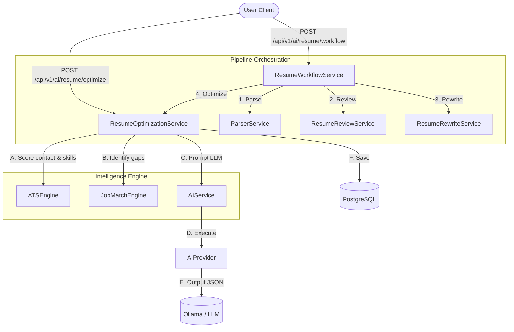

# AI Resume Optimization & Intelligence Engine

The **AI Resume Optimization & Intelligence Engine** (Phase 8 Part 5) provides CareerPilot AI's premium feature suite, combining parsing, deep AI reviews, targeted rewrites, and full-resume orchestration. It integrates python-based calculations (like ATS score and job description keyword analysis) with large language model semantic evaluations to create actionable improvements.

---

## 1. System Architecture

The engine utilizes a modular design which separates business components, AI engines, validation templates, database operations, and controllers:



---

## 2. API Reference

### Optimization API

#### `POST /api/v1/ai/resume/optimize`
Execute the AI Resume Optimization suite against a parsed resume.
*   **Request Payload**:
    ```json
    {
      "resume_id": "uuid-here",
      "job_description": "Optional raw target job description text...",
      "mode": "STANDARD",
      "model_override": null,
      "bypass_cache": false
    }
    ```
*   **Response Schema** (`ResumeOptimizationResponse`): Enforces categories scores, keyword analysis lists, achievement optimization rewrites, missing skills suggested resources, and career readiness.

#### `GET /api/v1/ai/resume/optimization/{id}`
Fetch detailed analysis recommendations for a single optimization run by UUID.

#### `GET /api/v1/ai/resume/optimizations`
Retrieve historical optimization runs for the current user. Filters by `resume_id` if supplied.

#### `DELETE /api/v1/ai/resume/optimization/{id}`
Remove a historical optimization run by ID.

---

### Workflow API

#### `POST /api/v1/ai/resume/workflow`
Run the complete AI pipeline in sequence.
1.  **Resume Parser**: Verifies and parses the resume text.
2.  **Resume Review**: Evaluates overall sections strengths and weaknesses.
3.  **Resume Rewrite**: Tailors bullet points to the job description or standard modes.
4.  **Resume Optimization**: Generates the final optimization engine payload and category scoring.
*   **Request Payload**: Same as `ResumeOptimizationRequest`.
*   **Response Schema** (`ResumeWorkflowResponse`): Summarizes state changes for each stage and returns references to review, rewrite, and optimization database IDs.

---

## 3. Optimization Modes Configuration

Modes are configuration-driven within [config.py](file:///c:/CareerPilot%20AI/backend/app/ai/config.py):

*   **`BASIC`**: Lower token budget (max 2048) and low temperature (0.2).
*   **`ADVANCED`**: Full coverage (max 4096) and low temperature (0.2).
*   **`PROFESSIONAL`**: Highest fidelity formatting, keywords, and metrics optimization (max 4096).

---

## 4. Prompt Engineering

The Jinja template is declared under [optimization.jinja](file:///c:/CareerPilot%20AI/backend/app/ai/prompts/templates/resume/optimization.jinja). It enforces:
*   Strict compliance with Pydantic JSON schemas.
*   Preservation of factual data (no fabricated metrics or achievements).
*   Quantitative improvements (identifying and correcting weak action verbs and missing business value metrics).

---

## 5. Developer Onboarding & Extensions

### Adding Support for Future Industries
Industry alignments are returned as a list of `IndustryAlignmentDetail` containing `industry` and `confidence`. To add a new target industry (e.g., "Product Manager", "DevOps Engineer"):
1.  Update the `resume/optimization` prompt instructions under [optimization.jinja](file:///c:/CareerPilot%20AI/backend/app/ai/prompts/templates/resume/optimization.jinja).
2.  Add the new industry to the listed categories instructions.
3.  No Pydantic or database code changes are required because the list architecture naturally supports key-value string expansions.
