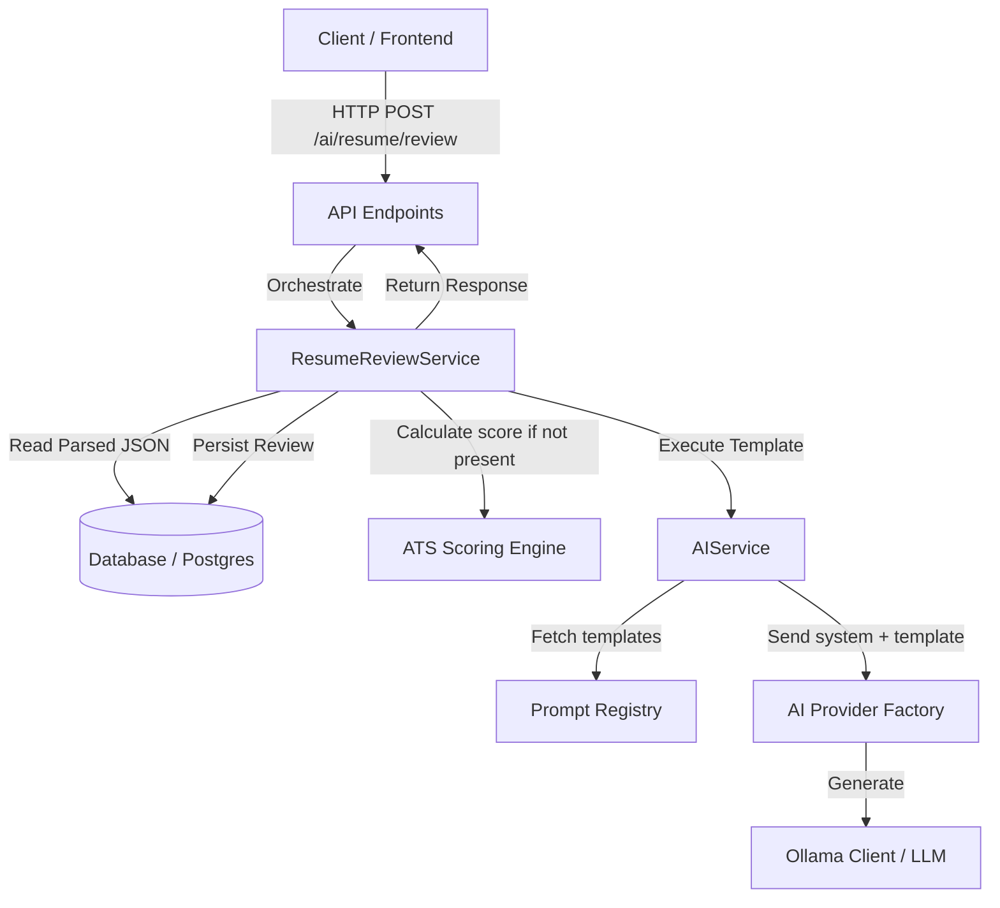

# AI Resume Review Engine

The AI Resume Review Engine is a core production feature of CareerPilot AI that analyzes parsed resume JSON and generates structured, actionable, and multi-dimensional feedback using local or external Large Language Models (LLMs).

---

## Architecture

The engine follows clean architecture principles, separating API routing, service orchestration, LLM interfacing (via `AIService`), and database persistence.



---

## Detailed Data Flow

1. **API Request**: The user submits a request to review a resume (`resume_id`, `mode`, `language`, `model_override`, `bypass_cache`).
2. **Retrieve & Validate**: The `ResumeReviewService` retrieves the `Resume` model, verifies it exists and is owned by the requesting user, rejects empty resumes, rejects unsupported parser versions (< 1.0.0), and validates that the JSON structure is present.
3. **Cache Lookup**: If `bypass_cache` is `False`, the service queries the `ai_resume_reviews` table for any pre-existing review of the same resume using the identical configuration (mode, language, model). If found, it is returned instantly.
4. **ATS Output Integration**: The service calls `calculate_ats_score(resume)` to retrieve the ATS engine output (scores, breakdowns, recommendations) and inputs this context into the prompt so the LLM can explain *why* the ATS score is high or low without duplicating the logic.
5. **AI Service Call**:
   - The `AIService` retrieves the shared system prompt (`shared/system_prompt`) and the specific versioned prompt (`resume/review`) from the prompt registry.
   - It automatically prepends the shared system instructions to the LLM request to ensure professional, deterministic, and non-hallucinatory behavior.
   - It calls the model (default `qwen2.5:3b` or customized override) with `temperature = 0.2` for highly deterministic results.
6. **Parsing & Mapping**: The LLM's raw JSON response is parsed into Python dictionaries, checked, and saved to the `ai_resume_reviews` table along with performance audit metadata (latency, tokens, etc.).
7. **Response Serialization**: The database model is mapped to a clean, flat Pydantic `ResumeReviewResponse` schema and sent back to the client.

---

## Prompt Template

### Shared System Prompt (`shared/system_prompt`)
Instructs the AI to act professionally, avoid fabrication or guessing, return JSON only, respect missing fields, and provide concrete recommendations.

### Resume Review Prompt (`resume/review`)
Forces the AI to assess the resume across 17 distinct attributes:
- Professional Summary, Skills, Experience, Projects, Education, Certifications, Achievements, Contact Info, Formatting, ATS Compatibility, Consistency, Grammar, Action Verbs, Technical Strength, Missing Sections, Career Readiness, and Overall Impression.
- Restricts the AI from fabricating information.
- Defines high, medium, and low priority tags.
- Categorizes section-by-section scoring.

---

## Schemas

### Database Table (`ai_resume_reviews`)
```sql
CREATE TABLE ai_resume_reviews (
    id UUID PRIMARY KEY DEFAULT gen_random_uuid(),
    user_id UUID NOT NULL REFERENCES users(id) ON DELETE CASCADE,
    resume_id UUID NOT NULL REFERENCES resumes(id) ON DELETE CASCADE,
    review JSONB NOT NULL,
    metadata JSONB,
    provider VARCHAR(50) NOT NULL,
    model VARCHAR(100) NOT NULL,
    prompt_version VARCHAR(20) NOT NULL,
    created_at TIMESTAMP WITHOUT TIME ZONE NOT NULL DEFAULT now(),
    updated_at TIMESTAMP WITHOUT TIME ZONE NOT NULL DEFAULT now()
);
```

### Pydantic Models
The engine relies on Pydantic schemas defined in `app/schemas/ai_resume_review.py`:
- `PriorityLevel`: Enum (`HIGH`, `MEDIUM`, `LOW`)
- `Recommendation`: Struct explaining the `reason`, `impact`, `suggested_fix`, and `estimated_benefit`.
- `ResumeSectionReview`: Struct for specific resume section scores and feedback.
- `ReviewMetadata`: Execution tracking details.
- `ResumeReviewResponse`: Fully structured merged output.

---

## Developer Guide

### Running Review Locally
Endpoints are mounted under the `/api/v1/ai/` prefix:
- `POST /api/v1/ai/resume/review`
- `GET /api/v1/ai/resume/review/{id}`
- `GET /api/v1/ai/resume/reviews`
- `DELETE /api/v1/ai/resume/review/{id}`

### Running Tests
To run unit and API integration tests:
```bash
cd backend
.\venv\Scripts\pytest ..\tests\test_ai_resume_review.py
```

---

## Future Extensions

1. **Multilingual Prompts**: The prompt templates are architected to support dynamic translation variables based on the `language` argument.
2. **Model Upgrades**: Dynamic `model_override` is supported out-of-the-box by passing the model identifier to the factory.
3. **Frontend Highlighting**: Recommendations include priority levels (`HIGH`, `MEDIUM`, `LOW`) allowing future frontend rendering engines to highlight specific code blocks or lines of a PDF resume.
