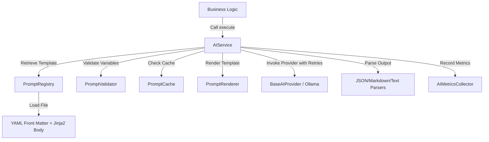

# CareerPilot AI — Prompt Management & AI Service Layer

This documentation outlines the architecture, standards, lifecycle, and development guides for the **Prompt Management System** and **AI Service Layer** implemented in Phase 8 Part 2.

---

## 1. Prompt Architecture

The system decouples prompt design from the application code. Prompt templates are stored as external Jinja2 files and managed by a centralized service layer.



### Key Components
1. **`PromptRegistry`**: Scans the templates directory, stores metadata/templates in memory, and handles version resolution.
2. **`PromptRenderer`**: Compiles and renders templates using **Jinja2**, supporting loops, conditionals, imports, blocks, and includes.
3. **`PromptValidator`**: Detects syntax errors, missing context variables, unknown/extra variables, and empty rendered prompts.
4. **`PromptCache`**: Thread-safe in-memory cache using TTL validation and SHA-256 keys based on input context variables.
5. **`AIService`**: Orchestrates the entire lifecycle and adds transient error retries (with exponential backoff) and parser invocation.
6. **`AIMetricsCollector`**: Thread-safe tracker for success, failure, retries, and cache stats (without logging prompts for privacy compliance).

---

## 2. Prompt Lifecycle

A prompt undergoes the following stages during an execution request:

1. **Resolution**: The registry locates the correct file under the specified category (e.g. `resume`) and resolves the version (specific or latest).
2. **Validation**: The validator compares the provided variables against the template's expected variables. If any variables are missing or unknown, an `InvalidPrompt` exception is raised.
3. **Cache Lookup**: If cache is enabled, the service hashes the request parameters. A hit returns the response immediately.
4. **Rendering**: The Jinja2 engine renders variables, conditionals, loops, or block imports into the final prompt text.
5. **Post-Validation**: The rendered text is checked to ensure it is not empty.
6. **Provider Call**: The active AI Provider (e.g. `OllamaProvider`) is called. If a transient error occurs (timeout/unavailable), the service retries with exponential backoff up to the configured retry count.
7. **Parsing**: The raw string response from the LLM is parsed into the requested format (text, JSON, markdown, or markdown_json) and validated.
8. **Cache Store**: The parsed result is cached for the configured TTL duration.
9. **Metrics Logging**: Latencies, success, failure, or retry metrics are logged.

---

## 3. Template Standards

Every prompt template is stored as a file (extension `.jinja`, `.txt`, `.yaml`, or `.html`) and must begin with a **YAML front matter** block, followed by the template body.

### Front Matter Format
```yaml
---
name: [prompt_name]
version: [semantic_version]
description: [short description of what it does]
author: [author name/team]
last_updated: [YYYY-MM-DD]
metadata:
  category: [category matching the folder]
  [optional custom metadata]: [values]
---
[Template Body Begins Here...]
```

### Jinja2 Support
Your template body can use any Jinja2 feature.
- **Variables**: `{{ name }}`
- **Conditionals**:
  ```jinja
  
  Prioritize leadership and architectural experience.
  
  Focus on technical execution and growth.
  
  ```
- **Loops**:
  ```jinja
  Skills list:
  
  - {{ skill }}
  
  ```
- **Includes / Reusable Blocks**:
  ```jinja
  
  ```

---

## 4. Versioning & Naming Conventions

### Naming Conventions
- **Folders**: Must match one of the categories (`shared/`, `resume/`, `interview/`, `career/`, `cover_letter/`).
- **Files**: Lowercase, snake_case (e.g., `resume_review.jinja`).
- **Prompt Name**: Match the file name or represent the specific task (e.g. `resume_review`).

### Versioning Rules
- Prompts use **Semantic Versioning** (`MAJOR.MINOR.PATCH`):
  - **PATCH**: Tiny wording tweaks, formatting, or spelling corrections. (e.g., `1.0.0` -> `1.0.1`)
  - **MINOR**: Adding new optional parameters, refining instructions, or changing structure without breaking existing calls. (e.g., `1.0.1` -> `1.1.0`)
  - **MAJOR**: Breaking changes, removing required parameters, or entirely changing the expected output schema. (e.g., `1.1.0` -> `2.0.0`)

---

## 5. Developer Guide

### Injecting and Using the AI Service
To consume the AI Service in any FastAPI router or service, inject it using `get_ai_service`:

```python
from fastapi import APIRouter, Depends
from app.ai.dependencies import get_ai_service
from app.ai.services import AIService

router = APIRouter()

@router.post("/review")
async def review_resume(
    resume_text: str,
    ai_service: AIService = Depends(get_ai_service)
):
    # Execute prompt: category='resume', name='resume_review', variables={'resume_text': ...}
    result = await ai_service.execute(
        category="resume",
        name="resume_review",
        variables={"resume_text": resume_text},
        parser_type="text" # can be 'json', 'markdown', or 'markdown_json'
    )
    
    return {
        "score": result.parsed_response,
        "prompt_version": result.prompt_version,
        "latency_ms": result.latency_ms
    }
```

---

## 6. Future Prompt Creation Guide

To add a new prompt to the system:

1. **Create the Template File**:
   Identify the category (e.g. `interview/`). Create `backend/app/ai/prompts/templates/interview/behavioral_analysis.jinja`.
2. **Add Metadata**:
   Write the front matter with the correct version `1.0.0`, category `interview`, and name `behavioral_analysis`.
3. **Write the Template Body**:
   Write the prompt using Jinja2 syntax and save it.
4. **Call the Service**:
   Use `ai_service.execute(category="interview", name="behavioral_analysis", variables={...})` in your backend code.
5. **Add Tests**:
   Update or write tests validating that the new variables work correctly.
