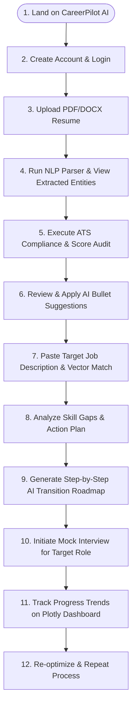
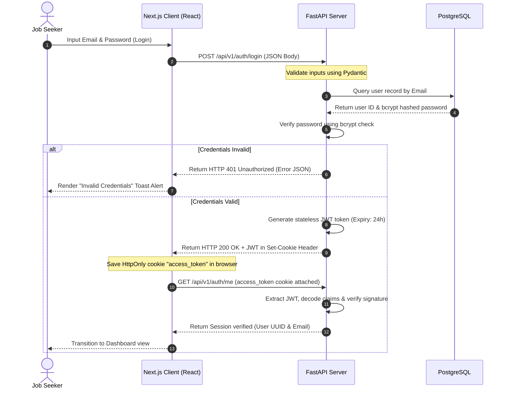
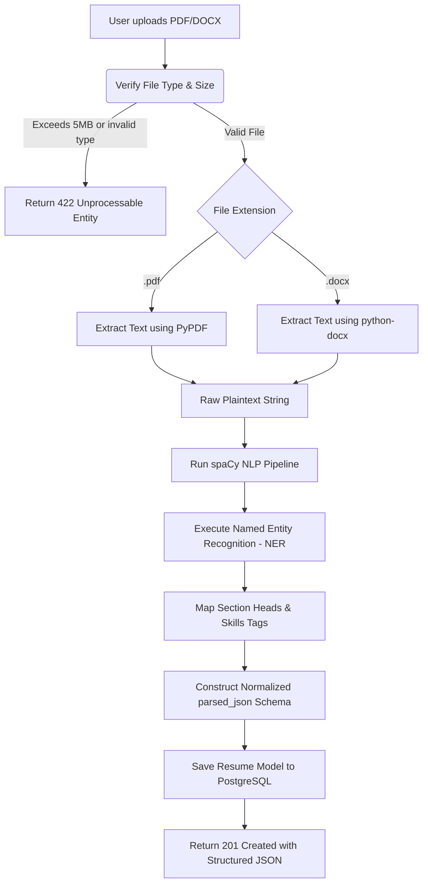
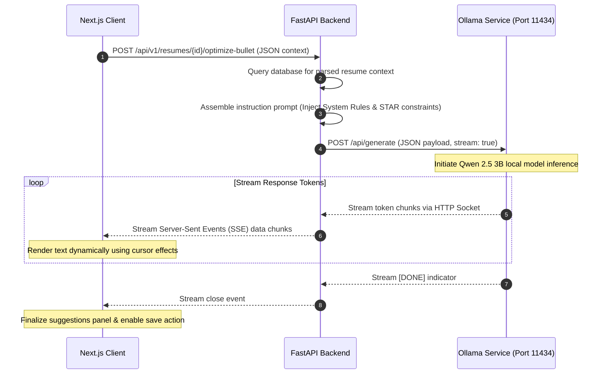
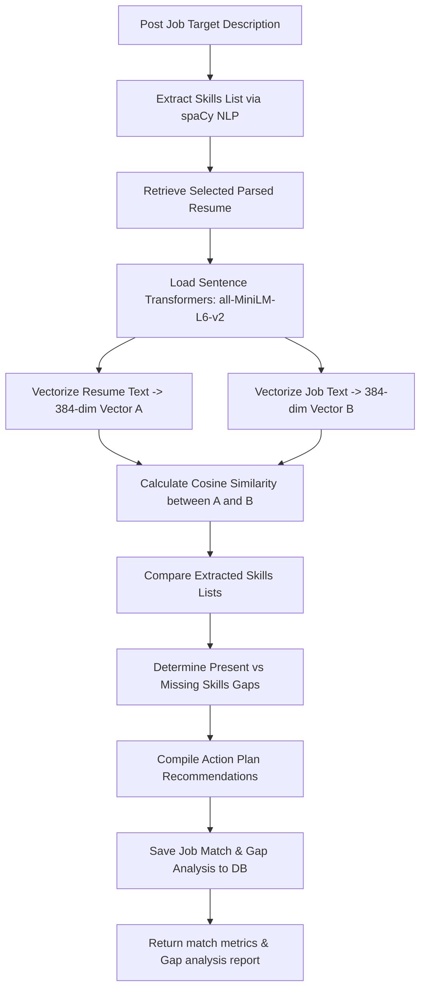
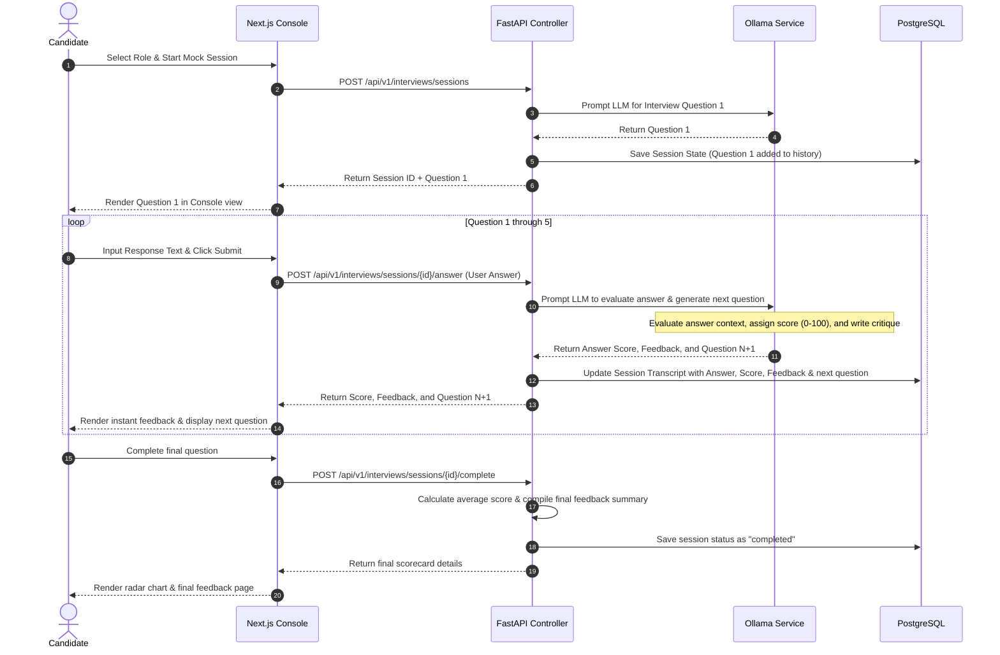
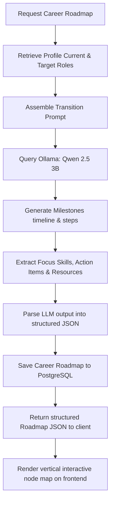
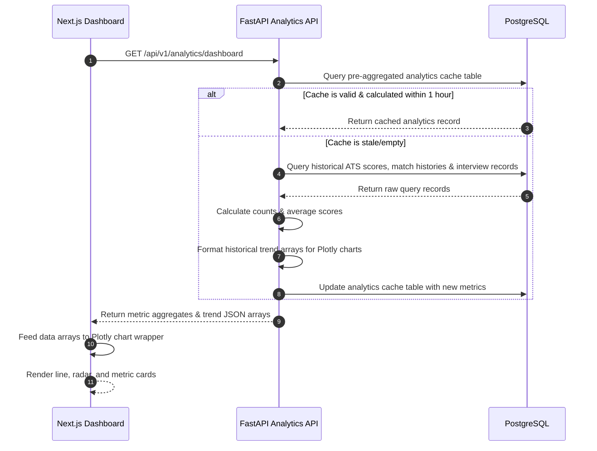
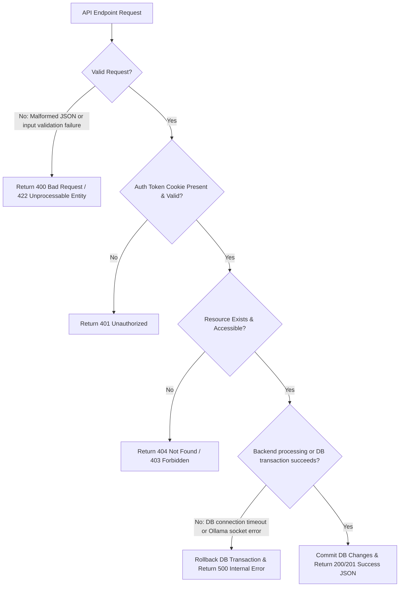

# System Workflow Specification

## CareerPilot AI — The Intelligent Career Copilot

---

## 1. Complete User Journey Overview

The user journey in CareerPilot AI is designed to guide a job seeker step-by-step from initial signup to mock interview readiness and career tracking.

---

## 2. Core Architectural Workflows

This section maps out the detailed execution sequences, message exchanges, and logic paths for the application's core workflows.

### 2.1 Authentication Workflow
This workflow uses secure HttpOnly session cookies to manage authentication, preventing client-side script token theft (XSS protection).

**Workflow Explanation:**
*   Password verification is handled securely using bcrypt hashing at the database boundary.
*   Once validated, the backend generates a standard JWT containing the user's ID and sets it as an `HttpOnly`, `Secure`, `SameSite=Strict` cookie.
*   Subsequent requests automatically include this cookie. The backend middleware decodes and verifies the token, ensuring secure, stateless session management.

---

### 2.2 Resume Upload & Parsing Workflow
Processes binary document templates, extracts raw text, and generates structured JSON data using spaCy NLP.

**Workflow Explanation:**
*   The upload handler validates that the file matches supported MIME types and size limits.
*   The system uses `PyPDF` or `python-docx` to extract raw text, which it passes to the `parser_service`.
*   The parser runs tokenization, part-of-speech tagging, and custom entity matching using a local spaCy pipeline. The structured output is saved to the database and returned to the frontend.

---

### 2.3 Local AI Integration (Ollama Orchestration)
Runs local LLM calls using `httpx` to connect to the local Ollama API, streaming outputs via Server-Sent Events (SSE).

**Workflow Explanation:**
*   To keep client interfaces responsive during long LLM calls, the FastAPI backend routes requests asynchronously.
*   The backend connects to the local Ollama instance (`http://127.0.0.1:11434`) using `httpx` and streams response tokens in real-time.
*   These tokens are forwarded to the client using Server-Sent Events (`text/event-stream`), enabling a smooth, dynamic typing effect on the frontend.

---

### 2.4 Semantic Job Matching Workflow
Calculates match ratings between candidate profiles and job requirements using sentence-transformers vector embeddings.

**Workflow Explanation:**
*   The matching engine extracts target skills from both the resume and the job description.
*   It vectorizes both texts using the `all-MiniLM-L6-v2` transformer model, producing 384-dimensional dense vectors.
*   The system calculates the cosine similarity between the vectors, compares the skills to identify gaps, compiles a recommended action plan, saves the results, and returns the metrics to the frontend.

---

### 2.5 Interactive Mock Interview Loop Workflow
Guides users through mock interview sessions, managing state, generating questions, and grading responses.

**Workflow Explanation:**
*   The interview module tracks progress through 5 questions using session history stored in the database.
*   For each response, the local LLM evaluates the user's answer, assigns a score (0-100), provides feedback, and generates the next question.
*   Once completed, the system calculates average scores, logs the completed status, and renders performance metrics on the frontend.

---

### 2.6 AI Career Roadmap Workflow
Generates step-by-step career roadmaps based on current profiles and target roles.

**Workflow Explanation:**
*   The user requests a career roadmap by specifying a current and target role.
*   The backend queries the local LLM to generate transition milestones, including focus areas, timelines, action items, and learning resources.
*   The output is parsed into structured JSON, saved to the database, and rendered as an interactive node map on the frontend.

---

### 2.7 Dashboard Analytics Workflow
Aggregates performance data, matches, and scores to feed interactive charts on the frontend.

**Workflow Explanation:**
*   To keep dashboard loads fast, the system uses a pre-aggregated `analytics` table.
*   If the cached data is valid, it is returned immediately. Otherwise, the backend runs queries to calculate new averages and trends, updates the cache, and returns the data.
*   The frontend uses the returned JSON arrays to render interactive Plotly charts.

---

### 2.8 System Error Handling Workflow
Enforces error boundaries across the application, returning standard error payloads for unexpected issues.

**Workflow Explanation:**
*   API requests pass through layers of validation and security.
*   Input validation failures return `400` or `422` errors. Authentication checks return `401` errors, and missing resources return `404` errors.
*   Any database or LLM socket errors are caught, pending database changes are rolled back, and the client receives a standardized `500` error payload.
